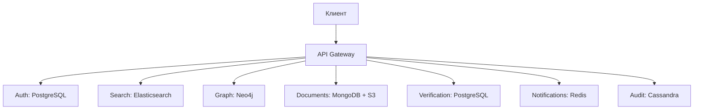

### **Домашка 3: Базы данных**  

#### **1. Сервисы из HW_2**  
1. **Auth** – аутентификация и авторизация.  
2. **Search** – поиск людей.  
3. **Graph** – визуализация генеалогического древа.  
4. **Documents** – хранение и обработка документов.  
5. **Verification** – верификация данных.  
6. **API Gateway** – единая точка входа.  
7. **Notifications** – уведомления.  
8. **Audit** – логирование действий.  

---

### **2. Выбор БД под сценарии**  

| Сервис | Сценарий | Выбор БД | Обоснование |  
|--------|----------|----------|-------------|  
| **Auth** | Хранение пользователей, сессий, токенов | **PostgreSQL** | Транзакционность, надежность, поддержка JSON для метаданных. |  
| **Search** | Поиск по людям (имя, дата, связи) | **Elasticsearch** | Полнотекстовый поиск, высокая скорость (NFR3). |  
| **Graph** | Хранение и обход графа (родственные связи) | **Neo4j** | Графовая БД оптимизирована для связей и обхода дерева. |  
| **Documents** | Хранение сканов, метаданных | **MongoDB (документы) + S3 (файлы)** | Гибкость схемы для метаданных, S3 – для бинарных данных. |  
| **Verification** | Верификация, история изменений | **PostgreSQL** | ACID-транзакции для согласованности данных (FR4). |  
| **Notifications** | Очереди уведомлений | **Redis (Pub/Sub)** | Быстрая доставка, поддержка WebSockets. |  
| **Audit** | Логирование действий | **Cassandra** | Запись-оптимизированная, масштабируется под большие объемы (NFR5). |  
| **API Gateway** | Кеширование запросов | **Redis** | Уменьшение нагрузки на сервисы (NFR1, NFR3). |  

---

### **3. Репликация и шардинг**  

#### **Репликация**  
- **PostgreSQL (Auth, Verification):** Master-Replica (1 мастер, 2+ реплики) для отказоустойчивости (NFR2, 99.9% uptime).  
- **Elasticsearch (Search):** Репликация индексов (3 ноды) для распределенного поиска.  
- **Neo4j (Graph):** Кластер с репликацией для чтения (Causal Clustering).  
- **Cassandra (Audit):** Multi-DC репликация (3 ноды на дата-центр) для надежности.  

#### **Шардинг**  
- **MongoDB (Documents):** Шардинг по `user_id` для равномерного распределения нагрузки.  
- **Elasticsearch (Search):** Шарды индексов по алфавиту (A-M, N-Z).  
- **Cassandra (Audit):** Шардинг по хэшу `event_id` (партиционирование).  

---

### **4. Дополнительные механизмы**  
1. **Кеширование:**  
   - **Redis** для API Gateway (кеш GraphQL-запросов).  
   - **CDN** для статики (сканы документов из S3).  

2. **Резервное копирование:**  
   - **PostgreSQL:** WAL-логи + ежедневные снепшоты.  
   - **S3:** Versioning + Cross-Region Replication.  

3. **Согласованность:**  
   - **Strong Consistency:** PostgreSQL (верификация).  
   - **Eventual Consistency:** Cassandra (аудит), Elasticsearch (поиск).  

