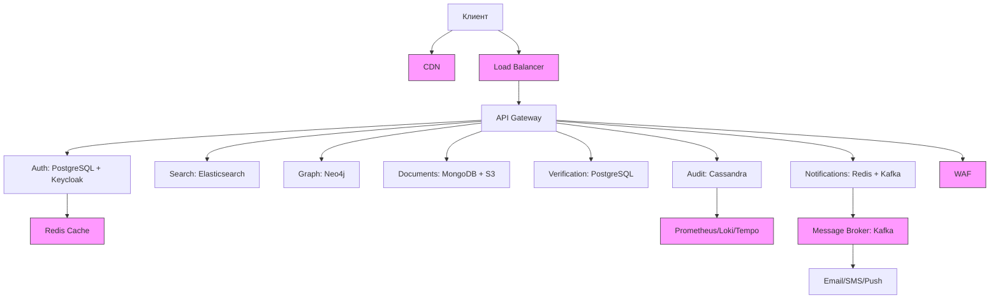

### **Доработанный High Level Design (HLD) с дополнительными компонентами**  

#### **1. Обязательные компоненты (MUST)**  

| Компонент               | Обоснование                                                                 | Реализация (опционально)                     |  
|-------------------------|-----------------------------------------------------------------------------|--------------------------------------------|  
| **Load Balancer**       | Распределение трафика между инстансами сервисов (NFR1, NFR2). Без него горизонтальное масштабирование невозможно. | AWS ALB / Nginx Ingress |  
| **CDN**                 | Доставка статики (сканы документов из S3) с edge-узлов. Снижает latency для глобальных пользователей (NFR3). | Cloudflare + AWS S3 |  
| **Кэш (Redis)**         | Уменьшение нагрузки на БД для "горячих" данных (токены, графовые запросы). | Redis Cluster (сессии, кеш GraphQL) |  
| **Identity Provider (IdP)** | Централизованная аутентификация/авторизация (OAuth 2.0, JWT). Интеграция с Auth-сервисом. | Keycloak / Auth0 |  
| **WAF (Web Application Firewall)** | Защита от OWASP Top 10 (SQLi, XSS). Обязательно для хранения персональных данных (152-ФЗ). | AWS WAF / Cloudflare WAF |  
| **CI/CD**               | Автоматизация развертывания. Без нее увеличится риск ошибок на проде (NFR4). | GitLab CI/CD (build → security scan → canary deploy) |  
| **Обзервабилити**       | Мониторинг, логирование, трейсинг для всех сервисов (NFR5). | Prometheus (метрики), Loki (логи), Tempo (трейсы), Grafana (визуализация) |  
| **Резервное копирование** | Гарантия восстановления данных (RPO < 1 мин). Требование 152-ФЗ для персональных данных. | WAL-G (PostgreSQL), S3 Versioning (документы) |  
| **Message Broker**      | Асинхронная обработка событий (нотификации, аудит, верификация). Без него система теряет отказоустойчивость. | Apache Kafka / RabbitMQ |  

---

#### **2. Рекомендуемые компоненты (SHOULD)**  

| Компонент               | Обоснование                                                                 | Реализация (опционально)                     |  
|-------------------------|-----------------------------------------------------------------------------|--------------------------------------------|  
| **Service Mesh**        | Упрощение управления трафиком между микросервисами (retries, timeouts). Полезно при >5 сервисах. | Istio / Linkerd |  
| **GeoDNS**              | Маршрутизация пользователей к ближайшему дата-центру (NFR3 для глобального покрытия). | AWS Route 53 (Geoproximity Routing) |  
| **Feature Flags**       | Безопасный rollout фич (например, экспериментальный поиск или верификация). | LaunchDarkly / Flagsmith |  
| **Rate Limiter**        | Защита от DDoS и злоупотреблений API (особенно для Search и Graph). | Redis + алгоритм Token Bucket |  
| **Secret Management**   | Безопасное хранение токенов, паролей БД. Обязательно при аудите безопасности. | HashiCorp Vault / AWS Secrets Manager |  

---

### **Обновленная схема системы**  

#### **Пояснения:**  
- **Фиолетовые блоки** — новые компоненты (MUST/SHOULD).  
- **Message Broker (Kafka)** добавлен как MUST: нотификации и аудит требуют асинхронности.  
- **WAF и GeoDNS** — критичны для безопасности и производительности.  
- **Service Mesh** — SHOULD, так как пока 8 сервисов, но при масштабировании станет MUST.  
